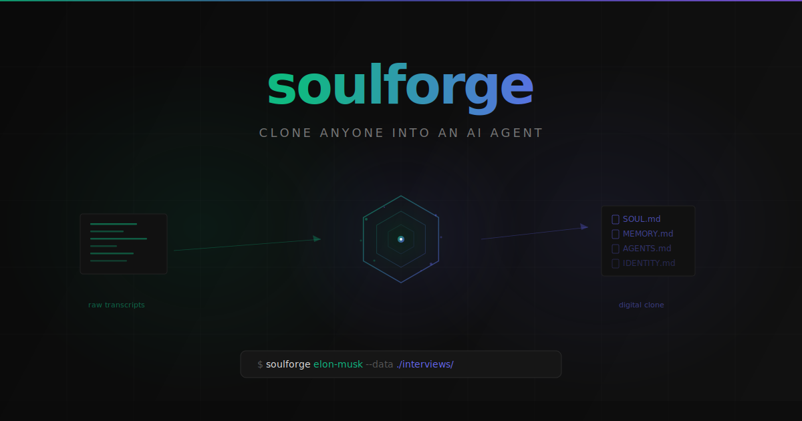

<p align="center">
  
</p>

<p align="center">
  Drop in a few interviews or transcripts. Get back a digital clone that thinks, talks, and makes decisions like the real person.
  <br>
  Built for <a href="https://github.com/openclaw/openclaw">OpenClaw</a>.
</p>

<br>

```bash
node src/index.js elon-musk --data ./elon-interviews/
```
```
⚒️  soulforge — forging "elon-musk"

Generating personality profile...
Generating knowledge base...
Generating agent behavior instructions...
Generating identity card...

✨ Done! Agent "elon-musk" is ready.
   Chat:  openclaw --agent elon-musk
```

Three transcripts in. A digital Elon out. Ask him to review your startup pitch. He'll tear it apart using first principles — just like the real one would.

<br>

## How It Works

You give it raw text about a person — interviews, podcasts, meeting transcripts, essays, anything where they're actually talking. Soulforge reads it all, then forges four files that capture *who this person is*:

```
~/.openclaw/workspace/agents/elon-musk/
├── SOUL.md        # Their mind — how they think, decide, and communicate
├── MEMORY.md      # Their experience — lessons, frameworks, war stories
├── AGENTS.md      # Their playbook — how they'd approach your problems
└── IDENTITY.md    # Their card — strengths, style, what they're best at
```

The result isn't a trivia bot that recites Wikipedia. It's a clone that actually reasons like them. It has their mental models, their verbal tics, their standards. Ask it to review your code and it'll give you feedback *at their level*.

<br>

## Try It Now

```bash
git clone https://github.com/xmuweili/soulforge.git
cd soulforge
npm install
```

Run the included example (3 Elon Musk interview transcripts):

```bash
node src/index.js elon-musk --data ./examples/elon-musk/
openclaw --agent elon-musk
```

Or clone someone you actually know:

```bash
node src/index.js my-cto --data ./cto-interviews/
node src/index.js naval --data ./naval-podcast-transcripts/
node src/index.js grandpa --data ./grandpa-stories/
```

Anyone with enough source material can be cloned. The more raw, unscripted material you feed it, the better the clone.

<br>

## What the Clone Looks Like

From just 3 interview transcripts, here's what soulforge generates:

**SOUL.md** — captures how they actually think:
```markdown
## Thinking & Problem-Solving

First principles is physics applied to everyday problems. I strip things
down to the most fundamental truths, then reason up from there. When
people said rockets were expensive, I looked at raw materials — aluminum,
carbon fiber, fuel — and they were maybe 2% of the price. The problem
wasn't physics; it was how the industry worked. So I rebuilt the process.
```

**MEMORY.md** — their real experiences, not a Wikipedia summary:
```markdown
## War Stories

**SpaceX Near-Death Experience:**
First three launches failed. Had enough money for three, maybe four.
"If the fourth one had failed, that was it — SpaceX was done.
But the fourth one worked. Sometimes you just have to keep going."
```

**AGENTS.md** — how the clone applies their thinking to *your* problems:
```markdown
1. Apply first principles to every problem — strip to physics and
   fundamental facts, reject "because that's how it's done."
2. When someone presents a problem, push to root cause —
   "what's actually limiting this?"
3. Challenge weak reasoning: "that's thinking by analogy, not
   first principles."
```

<br>

## Source Material

The clone is only as good as what you feed it. Best sources:

| Source | Why it works |
|---|---|
| Long-form interviews / podcasts | Captures how they *actually* think and talk |
| Q&A sessions / AMAs | Reveals how they handle curveballs |
| Personal essays / blog posts | Shows their written voice |
| Meeting transcripts | Captures working style under pressure |

**Pro tips:**
- Raw transcripts > polished articles. You want the "uh"s, the pauses, the self-corrections.
- 3-5 sources from different contexts gives a well-rounded clone
- Soulforge handles up to ~150K characters of source material

<br>

## Usage

```bash
node src/index.js <name> --data <path> [options]
```

| Option | Description |
|---|---|
| `--data, -d <path>` | Source files — directory or single file (required) |
| `--model, -m <model>` | Model override (default: from your `openclaw.json`) |
| `--enable-memory` | Chunk source material for OpenClaw's `memory_search` |
| `--help, -h` | Show help |

**Supported formats:** `.txt` `.md` `.pdf` `.docx` `.doc` — or any text file.

### Memory Mode

With `--enable-memory`, soulforge also chunks your raw source material into searchable files. OpenClaw's `memory_search` indexes them automatically — so the clone can pull up exact quotes and passages mid-conversation.

<br>

## API Keys

Soulforge reads your existing OpenClaw credentials. No extra setup needed.

**Lookup order:**
1. Provider config in `~/.openclaw/openclaw.json`
2. OAuth tokens from `~/.openclaw/agents/main/agent/auth-profiles.json`
3. `ANTHROPIC_API_KEY` environment variable

<br>

## Development

```bash
npm test     # 22 tests
npm start    # Run soulforge
```

<br>

## License

MIT
